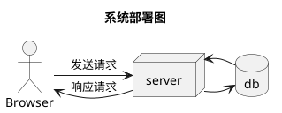

1. 一台应用服务器，安装ubuntu系统，使用docker运行服务

2. 一台数据库服务，安装ubuntu系统，使用docker安装数据库软件

```plantuml
@startuml
title 系统部署图

actor Browser as B
node server as S
database db as d
B->S:发送请求
S->B:响应请求
S->d
d->S
@enduml
```