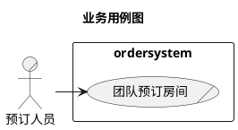
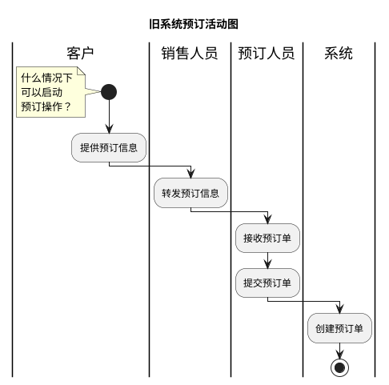
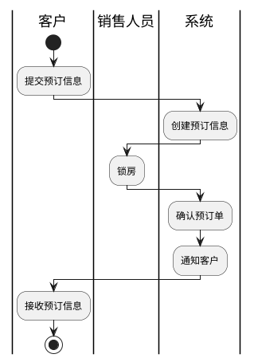
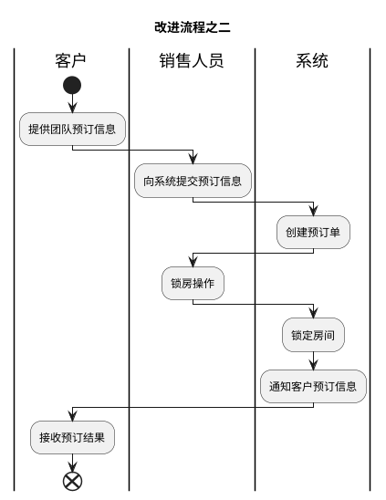
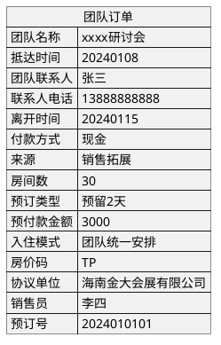

##### 团队预定

销售与客户成达预定协议，把预订信息提供给预订操作员，预订操作员在系统中提交预订信息。

##### 场景描述：

1. 销售人员与客户进行商务谈判，达成预订协议。
2. 客户向销售人员提供预订信息。
3. 销售人员把预订信息提供给预订人员。
4. 预订人员向系统提交预订信息
5. 系统创建预订单并保存

##### 活动图

现有系统中，团队预订图如下，实际操作的只有预订员。

旧系统中，直接与客户沟通的是销售人员，而做预订的是预订人员，这会增加沟通成本，而且会影响效率。

1.建立一个新的团队预订，首先要建立一个描述团队信息单以及团队内相关成员的信息单，成员信息单可以提供批量操作。

